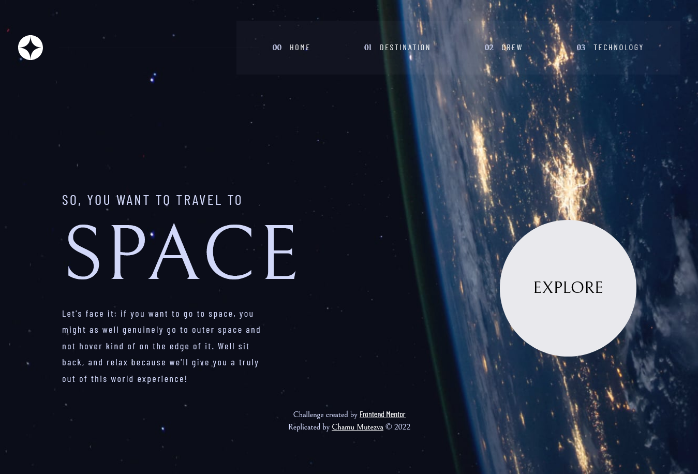
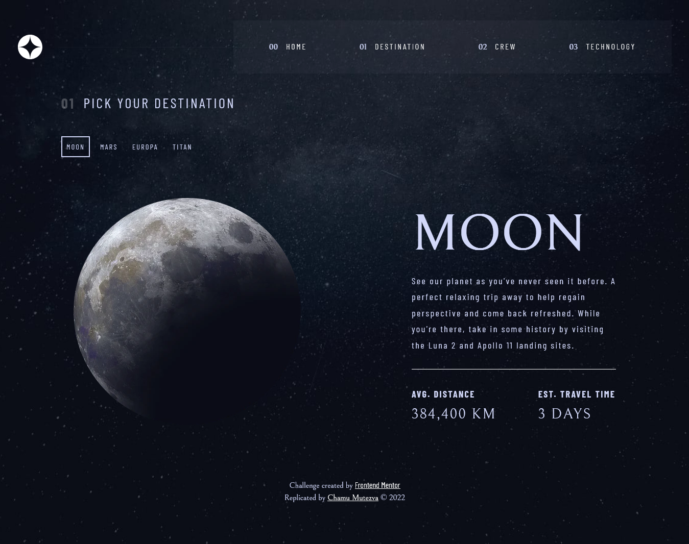
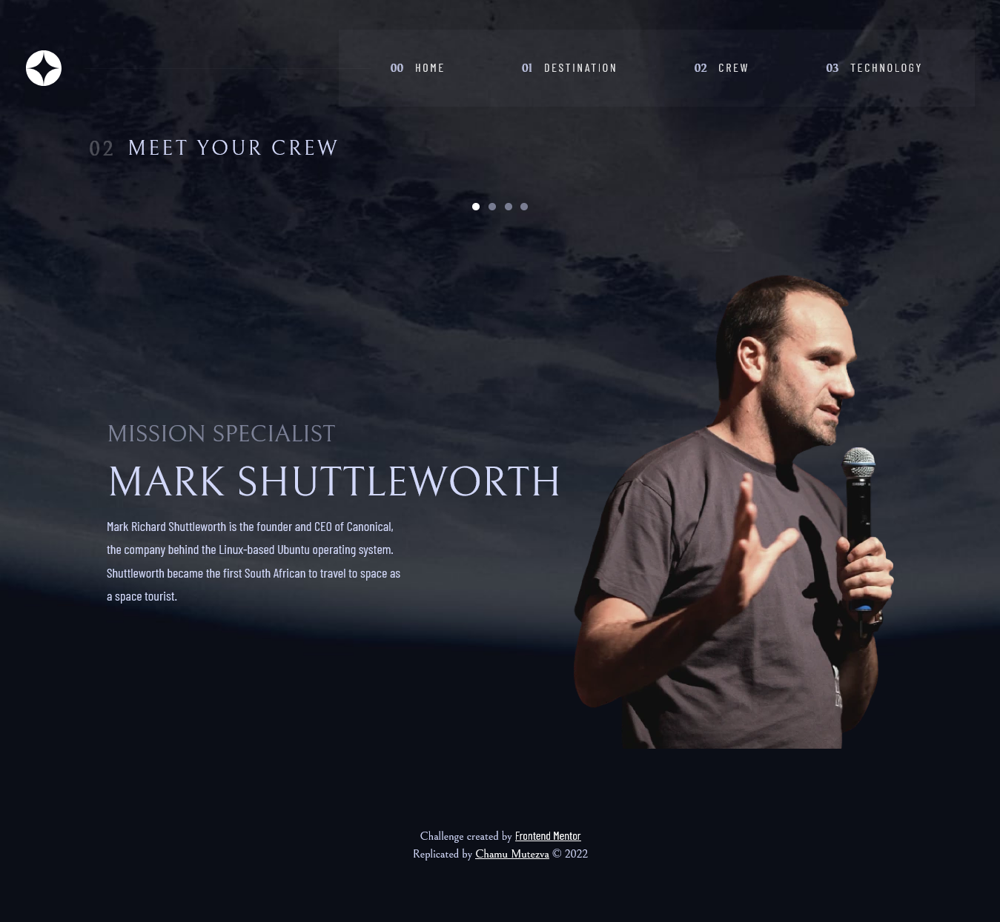
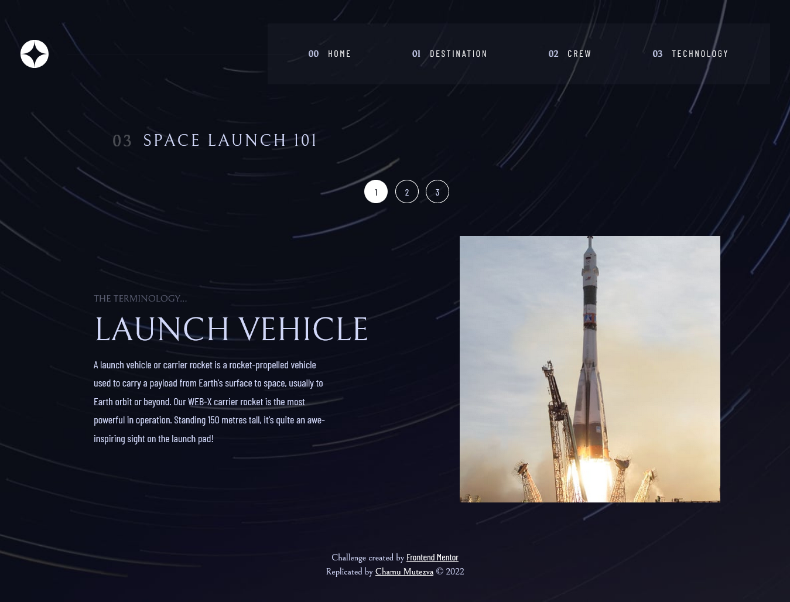

# Frontend Mentor - Space tourism website solution

This is a solution to the [Space tourism website challenge on Frontend Mentor](https://www.frontendmentor.io/challenges/space-tourism-multipage-website-gRWj1URZ3). Frontend Mentor challenges help you improve your coding skills by building realistic projects. 

## Table of contents

- [Overview](#overview)
  - [The challenge](#the-challenge)
  - [Screenshot](#screenshot)
  - [Links](#links)
- [My process](#my-process)
  - [Built with](#built-with)
  - [What I learned](#what-i-learned)
  - [Continued development](#continued-development)
  - [Useful resources](#useful-resources)
- [Author](#author)
- [Acknowledgments](#acknowledgments)

## Overview

### The challenge

Users should be able to:

- View the optimal layout for each of the website's pages depending on their device's screen size
- See hover states for all interactive elements on the page
- View each page and be able to toggle between the tabs to see new information

### Screenshot





### Links

- Live Preview url: [Live Preview Link](https://queseri.github.io/space-travel/)
- Frontend Mentor URL: [Add live site URL here](https://your-live-site-url.com)

## My process
- the site has 4 pages which are:
1. index.html
2. destination.html
3. crew.html
4. tech.html
- each page follows a layout format where the body has one div container child with a class of `container` with the exception of the `tech.html` where the div is named `wrapper` to allow a different styling from the others.
- these containers (`container` and `wrapper`) have 3 children each , which are `header`, `main` and `footer`

### Built with

- Semantic HTML5 markup
- CSS custom properties
- Flexbox
- CSS Grid
- Mobile-first workflow

### What I learned

One of the major highlights of this challenge was creating the navigation menu with some accessibility features to allow or assist people who rely on assistive technology. Some inspiration of the nav was drawn from the bootstrap implementation

```html
        <button class="navbar-toggler menu-btn-js" type="button"
             data-bs-toggle="collapse" data-bs-target="#navbarSupportedContent"
             aria-controls="navbarSupportedContent" aria-expanded="false"
             aria-label="Toggle menu navigation"> 
          
          
        </button>        
```
- this menu button is only present on mobile view and will be hidden from medium devices and onwards. The two images are for visual presentation only and therefore the `alt` value is left empty so that screen readers can skip the images. The `aria-controls` attribute of the button here identifies the element that is controlled by the button by attaching the id of the controlled element. Pressing the button toggles the navigation `on` and `off` . When the navigation is collapsed the `aria-expanded` should be changed to `true` and back to `false` when not collapsed. That will be achieved with a little javascript.


Another aspect that was interesting to learn from this challenge was to do with the tabbed interface. Much of the implementation was drawn from Heydon Pickering's [Inclusive Components - tabbed interface](https://inclusive-components.design/tabbed-interfaces/)

### Continued development

The technology page will need improvement to match design

### Useful resources

- Heydon Pickering's [Inclusive Components - tabbed interface](https://inclusive-components.design/tabbed-interfaces/)

## Author

- Website - [Chamu Mutezva](https://github.com/ChamuMutezva)
- Frontend Mentor - [@ChamuMutezva](https://www.frontendmentor.io/profile/ChamuMutezva)
- Twitter - [@ChamuMutezva](https://twitter.com/ChamuMutezva)

## Acknowledgments


